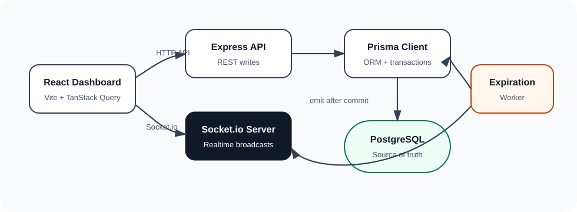
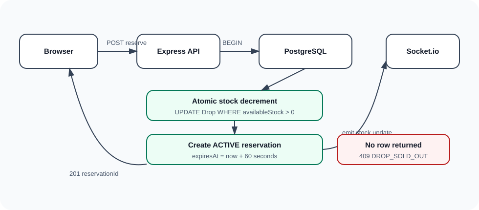
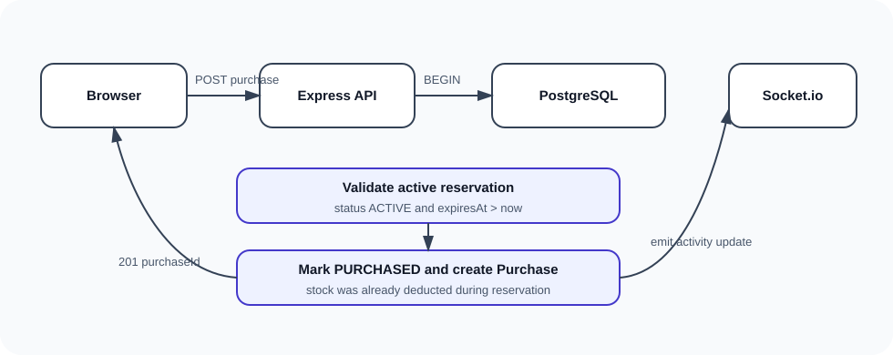
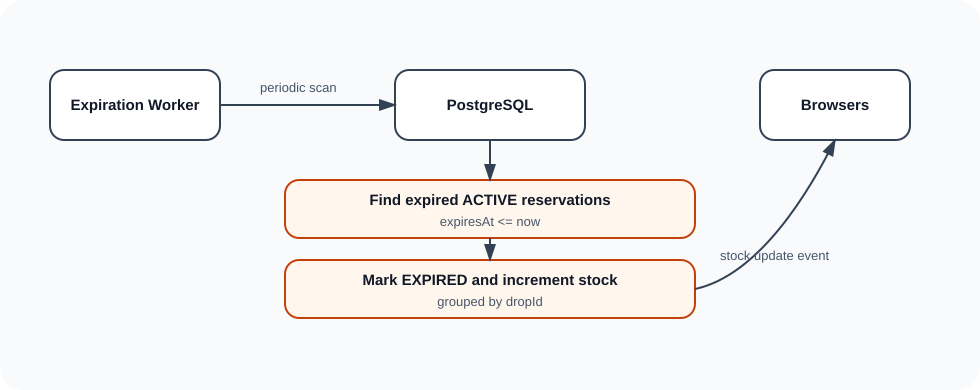

# Architecture

## Components

- React frontend renders drops, reservations, countdowns, and purchaser activity.
- Express API handles users, drops, reservations, and purchases.
- PostgreSQL stores authoritative inventory, reservation, and purchase state.
- Prisma provides schema, migrations, and normal query access.
- Socket.io broadcasts stock and activity updates after committed database writes.
- Expiration worker periodically recovers expired reservations.

## System Diagram



## Module Layout

```text
apps/api/src
├── config
├── db
├── jobs
├── middleware
├── modules
│   ├── drops
│   ├── purchases
│   ├── reservations
│   └── users
├── realtime
└── utils
```

Routes are intentionally thin. Business logic lives in service files, and database correctness lives in PostgreSQL transactions.

## Data Flow

The frontend initially fetches drops from `GET /api/drops`. It then connects to Socket.io and applies live updates to the cached drop list. If the socket reconnects, the frontend invalidates and refetches drops to recover any missed events.

Write operations use HTTP APIs, not Socket.io events. This keeps validation, status codes, errors, and retries straightforward.

## Reservation Flow



## Purchase Flow



## Expiration Flow



## Correctness Boundary

PostgreSQL is the source of truth. Socket.io is not used for correctness. Events are emitted only after database transactions commit.

The app remains correct if a browser disconnects, misses a socket event, or refreshes. On reconnect, the frontend refetches the drop list from `GET /api/drops`.

## Failure Handling

If reservation creation fails due to no stock, the API returns `409 Conflict`.

If a reservation expired before purchase, the API returns `409 Conflict`.

If the server restarts, expired active reservations are still recoverable because `expiresAt` is persisted.

If a client misses a WebSocket event, it refetches from the API on reconnect.
