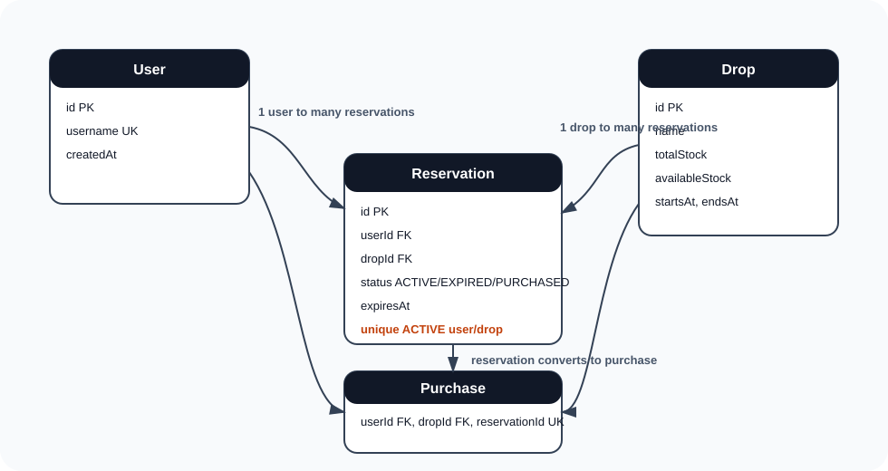

# Data Model

## ERD



## Tables

### User

Stores users by username. This is intentionally lightweight because authentication is not part of the assessment.

Relationships:

- One user has many reservations.
- One user has many purchases.

### Drop

Stores merch drop inventory.

- `totalStock`: original stock count.
- `availableStock`: currently reservable stock.
- `startsAt`: when the drop becomes available.
- `endsAt`: optional future extension.

Relationships:

- One drop has many reservations.
- One drop has many purchases.

### Reservation

Stores temporary claims on stock.

- `ACTIVE`: currently holding one unit.
- `EXPIRED`: reservation timed out and stock was returned.
- `PURCHASED`: reservation was converted into a purchase.
- `CANCELLED`: reserved for future explicit cancellation behavior.

Relationships:

- One reservation belongs to one user.
- One reservation belongs to one drop.
- One reservation can convert into one purchase.

### Purchase

Stores successful purchases and powers the latest purchasers activity feed.

Relationships:

- One purchase belongs to one user.
- One purchase belongs to one drop.
- One purchase belongs to one reservation.

## Important Constraints

The app uses a partial unique index so a user cannot hold multiple active reservations for the same drop:

```sql
CREATE UNIQUE INDEX reservation_unique_active_user_drop
ON "Reservation" ("userId", "dropId")
WHERE "status" = 'ACTIVE';
```

## Important Indexes

- `Reservation(expiresAt, status)` supports the expiration worker.
- `Reservation(dropId, status)` supports active reservation lookup.
- `Purchase(dropId, createdAt)` supports latest purchaser lookup.

## Stock Invariant

For each drop:

```text
availableStock >= 0
availableStock <= totalStock
```

The reservation flow protects this invariant using an atomic conditional update.

## Why Store `availableStock`?

`availableStock` is stored directly because the dashboard must read and broadcast stock frequently during high traffic. Computing availability from `totalStock - active reservations - purchases` can work, but it becomes more expensive under load and requires careful query tuning. In this implementation, writes are protected by database transactions and reads are cheap.

## Why Store `Purchase` Separately?

Purchases are immutable business history. The activity feed asks for the latest 3 successful purchasers per drop, so `Purchase(dropId, createdAt)` supports an efficient ordered lookup without scanning reservations.
